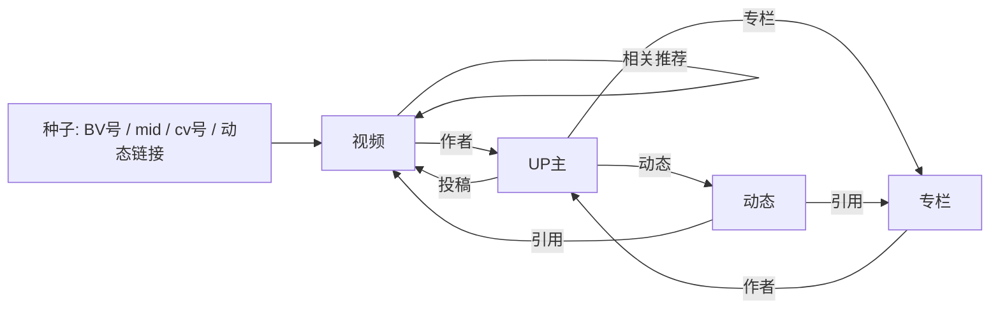

# BiliSearch · B 站离线模糊搜索

一个**静态 GitHub Pages 站点**：在本机用“图式爬虫”沿着**视频 / UP 主 / 动态 / 专栏 ID** 爬取 B 站元数据，构建成压缩索引，站点把索引下载到浏览器端做**模糊文本搜索**。站点只存标题、作者、描述等元数据与**跳转链接**，不存任何视频或正文内容。

B 站内置搜索基本不可用，因此本项目不依赖搜索接口，而是把种子 ID 当作入口，沿关系边扩散：



## 特性

- **本地定时爬取**：Windows 计划任务 / 常驻进程 / Linux cron 任选，爬取→建索引→部署全自动
- **客户端模糊搜索**：中文二元组 + 拉丁词元倒排，支持前缀、编辑距离纠错、单汉字扩散匹配
- **离线可用**：Service Worker 缓存索引，断网后仍可搜索
- **体积克制**：唯一依赖 `curl_cffi`（约 2MB，伪装 Chrome TLS 指纹）；索引 gzip 分片，可多仓库横向扩容
- **只存链接**：无视频、无正文，只有元数据与跳转地址

## 目录结构

```
crawler/            # 爬虫包（纯 Python，唯一依赖 curl_cffi）
  bili.py           # B 站 API 客户端：WBI 签名、限速重试、风控换指纹
  crawl.py          # 图式扩展逻辑、种子解析、增量状态
  __main__.py       # 命令行：单次爬取 / 常驻调度
build_index.py      # JSONL 原始数据 -> gzip 分片 + meta.json
site/               # 静态站点（部署到 GitHub Pages 的内容）
  search.js         # 零依赖搜索引擎（CJK bigram + 编辑距离）
  app.js / index.html / style.css / sw.js
scripts/
  deploy.ps1        # 构建 + 发布 site/ 到 gh-pages 分支
  register-task.ps1 # 注册 Windows 计划任务
  verify_search.mjs # Node 下验证搜索质量
seeds.txt           # 种子文件（BV / av / mid / cv / 动态链接）
data/               # 运行时数据（gitignore；可选提交到独立数据分支）
  raw/*.jsonl       # 抓取的元数据
  state.json        # cookie、WBI 密钥、去重时间戳
site/data/          # 构建产物（gitignore）
```

## 快速开始

```powershell
# 1) 安装依赖（建议虚拟环境）
python -m venv .venv
.\.venv\Scripts\python.exe -m pip install -r requirements.txt

# 2) 编辑 seeds.txt，填入你关心的 BV/av/mid/cv 或链接
# 3) 单次爬取并构建索引
.\.venv\Scripts\python.exe -m crawler --mode crawl --build --limit 300 --depth 1

# 4) 本地预览
python -m http.server 8080 -d site
# 打开 http://localhost:8080
```

> 说明：这台机器上 `.venv\Scripts\python.exe` 是 **venv 启动器**，运行时会出现两个进程（`.venv\...\python.exe` + 子进程 `C:\Python312\python.exe`），这是正常现象——**真正执行爬虫的是子进程**，父进程只是等待壳，锁也只被爬虫进程持有一次。想只看到一个进程，直接改用系统解释器：`C:\Python312\python.exe -m crawler ...`（已含 curl_cffi）。

参数速览（`python -m crawler --help`）：

| 参数 | 默认 | 说明 |
| --- | --- | --- |
| `--seeds` | `seeds.txt` | 种子文件路径 |
| `--seed` | - | 追加单条种子，可多次 |
| `--add-popular` | 0 | 先用 N 条热门视频当种子（无种子引导用） |
| `--depth` | 1 | 扩展跳数：1=抓种子及其邻居 |
| `--limit` | 300 | 单次最多新增条数 |
| `--interval` | 1.2 | 请求间隔秒数（风控敏感可加大） |
| `--refresh-days` | 7 | 距上次抓取 N 天内不重复抓同一实体 |
| `--build` | - | 爬完后自动运行 build_index.py |
| `--mode scheduler` | - | 常驻循环模式 |

## 运行体验

- 三种模式（crawl / burst / roam）都会**每 5 秒打印一行整体进度**：`[进度 roam] 37s | 300/300 | 成功 300 失败 0 | 486 条/分`（终端里原地刷新，管道/日志里逐行输出）
- **Ctrl+C**：第一次按下会优雅停止（当前请求结束后保存状态退出），第二次立即强制退出（退出码 130）
- **停止标记（不依赖 Ctrl+C）**：若你的启动方式（IDE/某些终端）收不到 Ctrl+C，执行 `powershell -ExecutionPolicy Bypass -File scripts\stop.ps1`，或手动创建 `data\stop` 文件，爬虫会在数秒内保存状态并退出；continuous 模式遇到任何异常也只会记录并继续下一轮，不会自动退出
- **单实例保护**：同一 `data/` 目录默认只允许一个爬取进程（`data/crawler.lock` 互斥锁），误开第二个会被直接拒绝，避免重复抓取和状态互相覆盖；确认无其他爬虫后可用 `--no-lock` 跳过

## 24 小时不间断爬取（continuous 模式）

在终端里跑一条命令即可**全天候漫游**，每隔 N 分钟自动构建索引并推送到 git：

```powershell
# 推荐（单进程）：
C:\Python312\python.exe -m crawler --mode continuous --sync-minutes 30 --workers 8 --interval 0.4
# 或用 venv（会出现 启动器+子进程 两个进程，属正常）：
.\.venv\Scripts\python.exe -m crawler --mode continuous --sync-minutes 30 --workers 8 --interval 0.4
```

- `--sync-minutes`：每隔多少分钟同步一次（构建索引 + `deploy.ps1 -Push` 推送到 gh-pages），默认 30
- 每轮漫游按时间片运行，`refresh-days` 自动去重，已抓过的视频不会重复抓
- 循环持续到 Ctrl+C：第一次优雅停止并保存状态，第二次强制退出（退出码 130）
- 某次同步失败（网络/凭据问题）不影响爬取，下一轮会自动重试
- 运行 continuous 前建议先停掉定时任务，避免两套爬取并发重复抓取：
  `Unregister-ScheduledTask -TaskName BiliSearch-Crawl`

## 视频批量快抓（burst 模式）

想快速铺量视频数据时用 burst：**多线程并发，只抓视频元数据本身**，不展开作者/动态/专栏。视频 ID 来源可以是列表文件、热门榜、分区排行榜：

```powershell
# 从列表文件抓取（每行一个 BV/av 或链接）
.\.venv\Scripts\python.exe -m crawler --mode burst --bv-file bvids.txt --workers 8 --interval 0.5 --build

# 从热门榜 + 多个分区排行榜收集并抓取
.\.venv\Scripts\python.exe -m crawler --mode burst --popular 200 --ranking 0,1,4,36,160,188 --workers 8 --interval 0.5 --build
```

burst 模式参数：

| 参数 | 说明 |
| --- | --- |
| `--bv-file` | 每行一个 BV/av 的视频列表文件 |
| `--popular N` | 从热门榜收集 N 条视频（每页 20，自动翻页） |
| `--ranking rid1,rid2` | 分区排行榜：0=全站，1=动画，3=音乐，4=游戏，5=娱乐，36=科技，119=鬼畜，129=舞蹈，155=时尚，160=生活，188=影视 |
| `--workers` | 并发数：无 cookie 建议 4~8；带 SESSDATA 可到 8~12 |
| `--interval` | 每个 worker 的请求间隔，**总请求频率 ≈ workers/interval 每秒**，风控敏感就调小 workers 或调大 interval |
| `--build` | 抓完后自动构建索引并发布（需配合 deploy） |

已抓过的视频在 `refresh-days` 内自动跳过，重复跑不会重复抓。可选登录 cookie（提高并发与降低风控概率）：

```powershell
.\.venv\Scripts\python.exe -m crawler --mode burst --popular 500 --workers 12 --interval 0.3 --cookie "SESSDATA=xxxx"
```

更推荐把**完整 cookie**（浏览器 F12 复制整段，含 SESSDATA/bili_ticket 等）存到 `data/cookies.txt`——爬虫每次运行自动加载并整体使用，无需写在命令行里：

```powershell
# 直接把整段 cookie 粘贴进 data/cookies.txt 保存即可
```

`data/cookies.txt` 与 `data/state.json` 都已 gitignore，不会进仓库。注意：cookie 是登录凭证，**不要外传**；如果曾在聊天/日志中分享过，建议在 B 站重新登录使旧 SESSDATA 失效后再更新本文件。

## 全站漫游（roam 模式）

想**不依赖具体种子、近似覆盖全站**地爬视频，用 roam：每个 worker 在“相关推荐”上随机游走，并以一定概率**跳转**到全站随机位置，避免永远困在热门/同主题小圈子里：

```powershell
# 默认：相关游走 + 20% 概率跳转（随机 av 探测 / 入站必刷 / 每周必看 / 热门）
.\.venv\Scripts\python.exe -m crawler --mode roam --limit 300 --workers 6 --interval 0.6 --build

# 只靠随机 av 号探测漫游（最“均匀”地扫过全站上传时间轴）
.\.venv\Scripts\python.exe -m crawler --mode roam --limit 500 --workers 8 --interval 0.5 --jump-sources aid --roam-jump 1.0
```

roam 相关参数：

| 参数 | 默认 | 说明 |
| --- | --- | --- |
| `--roam-jump` | 0.2 | 每步跳转概率；1.0=纯跳转不做相关游走 |
| `--jump-sources` | `aid,precious,series,popular` | 跳转源：`aid`=随机 av 号探测，`precious`=入站必刷，`series`=每周必看随机期数，`popular`=热门榜 |
| `--aid-min/--aid-max` | 1 / 150000000 | 随机 av 探测区间（av 号按投稿顺序递增） |
| `--series-max` | 200 | 每周必看最大期数 |
| `--fanout` | 3 | 每步随机选几条相关视频继续游走 |
| `--author-expand` | 0.05 | 抓到视频后按此概率扩展其作者，顺带收集其**专栏与动态** |

另外，漫游/快抓模式下，每条视频会**零额外请求**地派生一条 UP 主记录（作者名/ID 来自视频响应本身），漫游越久、可搜索的 UP 主越多；作者扩展成功后会补全签名等资料。

**为什么是“近似全站”**：B 站没有公开的全量视频列表接口，无法一次性枚举所有视频。roam 用三种互补机制逼近全覆盖：

1. **随机 av 号探测**：av 号基本按投稿时间递增，随机扫区间 = 对上传时间轴的近似均匀采样，天然覆盖非热门、老视频（实测命中率约 25%，其余多为已删除/私密稿件）；
2. **相关推荐随机游走**：沿内容图扩散，跳出榜单但会偏向同类内容；
3. **入站必刷/每周必看/热门**：提供经典与近期爆款跳板。

要真正“铺满”全站，建议把 roam 加进定时任务长期跑（例如每 6 小时 500 条预算），配合 `refresh-days` 自动去重：

```powershell
powershell -ExecutionPolicy Bypass -File scripts\register-task.ps1 -Mode roam -Limit 500 -Workers 6 -Deploy
```

注意：随机 av 探测会产生较多 404 请求，风控更敏感，`--interval` 建议 ≥0.5s。

## 部署到 GitHub Pages

仓库设置里把 Pages 的 Source 设为 `gh-pages` 分支，然后：

```powershell
# 构建索引并同步到 gh-pages 工作树
powershell -ExecutionPolicy Bypass -File scripts\deploy.ps1
# 推送
powershell -ExecutionPolicy Bypass -File scripts\deploy.ps1 -Push
```

之后每次定时任务跑完，把 `deploy.ps1 -Push` 接在后面即可自动更新线上索引。

## 定时任务（核心）

### 方式一：Windows 计划任务（推荐）

```powershell
# 注册：每 6 小时爬一次并构建索引
powershell -ExecutionPolicy Bypass -File scripts\register-task.ps1 -IntervalHours 6 -UseVenv
# 注册：爬取后自动发布到 gh-pages（需 git 已配置 GitHub 凭据）
powershell -ExecutionPolicy Bypass -File scripts\register-task.ps1 -IntervalHours 6 -UseVenv -Deploy
```

任务会运行 `python -m crawler --mode crawl --build ...`，工作目录为仓库根目录；加 `-Deploy` 后会在爬取完成后自动执行 `scripts\deploy.ps1 -Push`，实现“爬取→建索引→发布”全自动闭环。

想用快抓模式做定时任务也可以：`-Mode burst -Popular 200 -Ranking 0,1,4,36 -Workers 6 -IntervalSeconds 0.6 -Deploy`（更多参数见 burst 模式一节）。

### 方式二：常驻进程

```powershell
.\.venv\Scripts\python.exe -m crawler --mode scheduler --build --interval-hours 6 --limit 300 --depth 1
```

挂在后台即可；每轮完成后自动进入下一轮等待。

### 方式三：Linux / macOS cron

```bash
# crontab -e，每 6 小时跑一次（路径按实际修改）
0 */6 * * * cd /path/to/BiliSearch && .venv/bin/python -m crawler --mode crawl --build --limit 300 --depth 1 >> crawl.log 2>&1
```

### 方式四：GitHub Actions（可选）

仓库 `docs/publish.yml.example` 提供一份可选 Actions 工作流（手动触发；取消 `schedule` 注释后可定时跑）。如需启用：把该文件复制为 `.github/workflows/publish.yml`，并用**带 `workflow` 权限的 GitHub 凭据（PAT）**推送（普通 OAuth 凭据会被 GitHub 拒绝创建 workflow 文件）。注意 **GitHub 出口 IP 容易触发 B 站风控**，成功率不如本机任务，适合作为补充。

## 搜索效果

- 中文按**相邻二字（bigram）**索引，查询“罗翔 张三”会同时匹配标题/UP主/描述/分类中的词
- 英文/数字词支持**前缀**与**编辑距离**：输 `bili` 能命中 `bilibili`，`bilbili` 也能纠错
- 单个汉字自动扩散匹配包含该字的所有词，支持人名、生僻词
- 排序可切“相关度 / 最新”，结果按类型过滤

## 搜索语法与排序

普通词 = 模糊匹配（中文按相邻二字、拉丁按词/前缀）；并支持以下高级语法：

| 语法 | 示例 | 含义 |
| --- | --- | --- |
| `"精确短语"` | `"周处除三害"` | 强制精确包含（任意字段，大小写不敏感） |
| `-词` | `-电影` | 排除包含该词的记录 |
| `-"短语"` | `-"官方 MV"` | 排除包含该短语的记录 |
| `up:名称` / `author:名称` | `up:老番茄` | 只看该作者 |
| `-up:名称` | `-up:索尼音乐中国` | 排除该作者 |
| `type:类型` | `type:UP主` / `type:专栏` | 限定类型（video/UP主/动态/专栏，可中文） |

排序下拉提供：相关度 / 最新 / 最旧 / 标题长→短 / 标题短→长。
路由模式下，搜索时会显示**分片下载进度条**与覆盖率（已检索 X/Y 候选分片 · 全库 Z 分片）。

## 数据变大了怎么办（多分支 / 多仓库）

索引由 `site/data/meta.json` 里的 `shards[].url` 清单驱动，浏览器逐个分片加载，**分片之间互相独立**：

1. **稳定分桶（默认已开启）**：按 `(type:id)` 哈希分到固定 16 桶，文件名带内容哈希。无新增数据时重复构建**分片字节级不变**，git 不会产生新提交；有新增时只有命中的桶变化，历史增量极小；
2. **分片多仓库托管**：把某几个 `site/data/shards/*.jsonl.gz` 推到另一个仓库，再把 `meta.json` 里对应 `url` 改成
   `https://raw.githubusercontent.com/<user>/<repo>/<branch>/shards/XX-xxxx.jsonl.gz` 即可。浏览器按需跨域拉取，无需后端；
3. **原始数据放独立分支**：把 `data/` 提交到 `data-branch`，本机用 `git worktree add data-branch` 拉下来增量爬取，主仓库只保留代码与站点；
4. **极端省体积**：`python build_index.py --desc-len 0` 不索引描述（只搜标题/UP主/分类），体积可再降约一半。

原始数据是追加式 JSONL，`build_index.py` 按 `(type, id)` 去重、后写覆盖先写，重复跑不会膨胀索引。

## 规模与 GitHub 限制（重要）

GitHub 的硬性限制（2026 年口径）：

| 限制 | 数值 |
| --- | --- |
| 单文件 | 100MB 硬上限（50MB 警告） |
| Pages 站点 | 软上限约 1GB，超出后可能停止服务 |
| 仓库体积 | 建议 <1GB，硬上限约 5GB |
| Git LFS | **Pages 不支持**，大文件不能靠 LFS 绕过 |

当前索引 v2 格式实测约 **130B/条（gzip）**：100 万条 ≈ 130MB，1000 万条 ≈ 1.3GB。结论：**单仓库托管的安全范围约 300 万~500 万条**，再往上必须分片外置（多仓库 / 其他静态托管）。

项目已为这个上限做了三件事：

1. **紧凑格式 v2**：不存 URL（客户端由 id 推导）、空字段省略、类型数字编码，见 `build_index.py`；
2. **稳定分桶 + 内容哈希文件名**：未变化的分片不会被 git 重复提交，每次部署的增量只有真正变化的桶；
3. **分片清单外置**：`meta.json` 的 `shards[].url` 可指向任意仓库/外站，多仓库横向扩容不用改代码。

另外，**发布采用“快照式”**（`deploy.ps1`）：每次生成单一根提交并强制替换 gh-pages 历史，git 历史不会随索引增长而无限膨胀。实测 53.8 万条 ≈ 59MB（gzip），每同步一次就要全量推送约 60MB——因此**索引越大，同步间隔应该越长**（建议 `--sync-minutes` 随规模上调到 180+），本地磁盘回收可执行：

```powershell
git reflog expire --expire=now --all; git gc --prune=now
```

曾因旧版“普通提交式”部署导致仓库膨胀到 1.7GB，已切换快照式并清理（GitHub 后台 GC 会逐步收回旧对象）。

浏览器端现实上限：全量 JSON 解析 + 倒排索引在内存里，约 **100 万~200 万条以内体验良好**；更大规模需要“分片路由”（给每个分片挂关键词摘要、只下载相关分片）或换服务端搜索，这是下一步可做的方向。

## 数千万级架构（路由搜索 + 多仓库）

为了支持**数千万条**且保持 GitHub Pages 静态托管，项目已内置“两级静态搜索引擎”：

1. **构建期生成目录**：`build_index.py --mode routing` 把每条记录的词元（中文 bigram + 拉丁词）汇总成 **词→数据分片** 目录，按词排序切成若干目录分片（`site/data/dir/*.gz`）；
2. **查询时按需下载**：客户端先二分定位词所在的目录分片（下载 1~12 个，之后缓存），得到候选数据分片并**按相关度排序**，只下载前 N 个（默认 24MB / 64 个分片）扫描合并——**不加载全量**。命中分片不足时界面标注“结果可能不完整”。

实测（72.5 万条）：512 个数据分片（平均 165KB）+ 79 个目录分片（平均 511KB）；「周处除三害」下载 **1.4MB / 9 个分片 / 0.6s** 完整命中；热门词如「老番茄」按相关度只检索 64/246 分片（10MB）。

**多仓库/多分支托管数据分片**（防止 git 超支）：

1. 把 `deploy.config.example.json` 复制为 `deploy.config.json`，按组填写目标仓库/分支与 URL（`bases[].url` 留空 = 留在站点本身）：
   ```json
   { "group": 1, "url": "https://cdn.jsdelivr.net/gh/<user>/<repo>@data1", "branch": "data1" }
   ```
2. `deploy.ps1 -Push` 会先跑 `publish_shards.ps1` 把每个外部组**快照式**推送到对应分支/仓库，再从站点里剔除这些组，只发布“代码 + 目录 + 组 0”到 gh-pages。
3. 数据分片 URL 直接指向 jsdelivr / raw.githubusercontent（均带 CORS），浏览器可跨域加载。

规模估算：数据约 110B/条（gzip），**1000 万条 ≈ 1.1GB**，按组拆到 4~8 个仓库即可；目录分片约每百万条 55MB，留在主仓库。超过 200 万条后建议 `--sync-minutes` 调到 180+，减少全量推送次数。

## 风控与合规

- 本项目**只抓元数据与链接**，不下载视频、图片、正文内容；请以自用、低频、对他人无负担的方式使用
- B 站接口有风控（-352/-412/-509/-799）。客户端已内置：Chrome TLS 指纹伪装（curl_cffi）、随机限速、退避重试、遇风控自动换 buvid/WBI 指纹
- 若频繁被限，调大 `--interval`（如 2~5 秒）；登录后可用 `--cookie "SESSDATA=..."` 提升额度（敏感信息注意不要提交到仓库）
- 遵守 B 站服务条款与 robots 精神，不要把本项目用于批量恶意抓取

## 故障排查

| 现象 | 处理 |
| --- | --- |
| `code=-352/-412 风控` | 正常现象，客户端会自动重试换指纹；持续失败就加大 `--interval` 或换网络 |
| 某些接口一直失败 | 确认安装了 `curl_cffi`（`pip install -r requirements.txt`）；纯 urllib 回退成功率低 |
| 站点提示“索引加载失败” | 先运行 `python build_index.py`，确认 `site/data/meta.json` 存在且分片文件齐全 |
| 浏览器不支持解压 | 需要 Chrome/Edge≥102、Firefox≥113、Safari≥16.4 |
| 想清空索引重来 | 删除 `data/` 与 `site/data/` 后重新爬取 |
