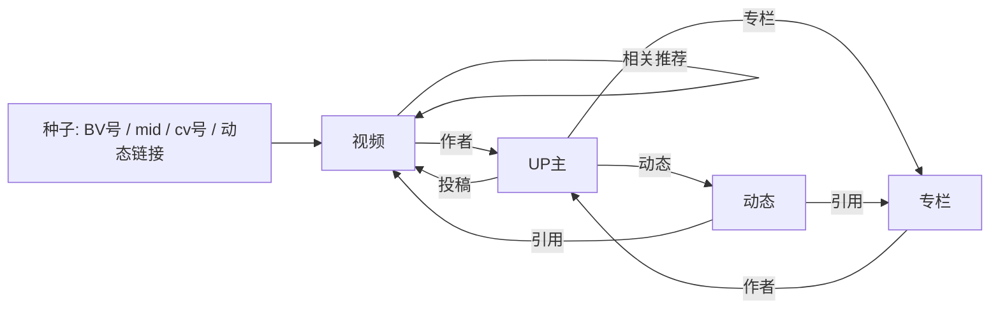

# BiliSearch · B 站离线模糊搜索

一个**静态 GitHub Pages 站点**：在本机用“图式爬虫”沿着**视频 / UP 主 / 动态 / 专栏 ID** 爬取 B 站元数据，构建成压缩索引，站点把索引下载到浏览器端做**模糊文本搜索**。站点只存标题、作者、描述等元数据与**跳转链接**，不存任何视频或正文内容。

B 站内置搜索基本不可用，因此本项目不依赖搜索接口，而是把种子 ID 当作入口，沿关系边扩散：



## 特性

- **本地定时爬取**：Windows 计划任务 / 常驻进程 / Linux cron 任选，爬取→建索引→部署全自动
- **客户端模糊搜索**：中文二元组 + 拉丁词元倒排，支持前缀、编辑距离纠错、单汉字扩散匹配
- **离线可用**：Service Worker 缓存索引，断网后仍可搜索
- **体积克制**：唯一依赖 `curl_cffi`（约 2MB，伪装 Chrome TLS 指纹）；索引 gzip 分片，可多仓库横向扩容
- **只存链接**：无视频、无正文，只有元数据与跳转地址

## 目录结构

```
crawler/            # 爬虫包（纯 Python，唯一依赖 curl_cffi）
  bili.py           # B 站 API 客户端：WBI 签名、限速重试、风控换指纹
  crawl.py          # 图式扩展逻辑、种子解析、增量状态
  __main__.py       # 命令行：单次爬取 / 常驻调度
build_index.py      # JSONL 原始数据 -> gzip 分片 + meta.json
site/               # 静态站点（部署到 GitHub Pages 的内容）
  search.js         # 零依赖搜索引擎（CJK bigram + 编辑距离）
  app.js / index.html / style.css / sw.js
scripts/
  deploy.ps1        # 构建 + 发布 site/ 到 gh-pages 分支
  register-task.ps1 # 注册 Windows 计划任务
  verify_search.mjs # Node 下验证搜索质量
seeds.txt           # 种子文件（BV / av / mid / cv / 动态链接）
data/               # 运行时数据（gitignore；可选提交到独立数据分支）
  raw/*.jsonl       # 抓取的元数据
  state.json        # cookie、WBI 密钥、去重时间戳
site/data/          # 构建产物（gitignore）
```

## 快速开始

```powershell
# 1) 安装依赖（建议虚拟环境）
python -m venv .venv
.\.venv\Scripts\python.exe -m pip install -r requirements.txt

# 2) 编辑 seeds.txt，填入你关心的 BV/av/mid/cv 或链接
# 3) 单次爬取并构建索引
.\.venv\Scripts\python.exe -m crawler --mode crawl --build --limit 300 --depth 1

# 4) 本地预览
python -m http.server 8080 -d site
# 打开 http://localhost:8080
```

参数速览（`python -m crawler --help`）：

| 参数 | 默认 | 说明 |
| --- | --- | --- |
| `--seeds` | `seeds.txt` | 种子文件路径 |
| `--seed` | - | 追加单条种子，可多次 |
| `--add-popular` | 0 | 先用 N 条热门视频当种子（无种子引导用） |
| `--depth` | 1 | 扩展跳数：1=抓种子及其邻居 |
| `--limit` | 300 | 单次最多新增条数 |
| `--interval` | 1.2 | 请求间隔秒数（风控敏感可加大） |
| `--refresh-days` | 7 | 距上次抓取 N 天内不重复抓同一实体 |
| `--build` | - | 爬完后自动运行 build_index.py |
| `--mode scheduler` | - | 常驻循环模式 |

## 视频批量快抓（burst 模式）

想快速铺量视频数据时用 burst：**多线程并发，只抓视频元数据本身**，不展开作者/动态/专栏。视频 ID 来源可以是列表文件、热门榜、分区排行榜：

```powershell
# 从列表文件抓取（每行一个 BV/av 或链接）
.\.venv\Scripts\python.exe -m crawler --mode burst --bv-file bvids.txt --workers 8 --interval 0.5 --build

# 从热门榜 + 多个分区排行榜收集并抓取
.\.venv\Scripts\python.exe -m crawler --mode burst --popular 200 --ranking 0,1,4,36,160,188 --workers 8 --interval 0.5 --build
```

burst 模式参数：

| 参数 | 说明 |
| --- | --- |
| `--bv-file` | 每行一个 BV/av 的视频列表文件 |
| `--popular N` | 从热门榜收集 N 条视频（每页 20，自动翻页） |
| `--ranking rid1,rid2` | 分区排行榜：0=全站，1=动画，3=音乐，4=游戏，5=娱乐，36=科技，119=鬼畜，129=舞蹈，155=时尚，160=生活，188=影视 |
| `--workers` | 并发数：无 cookie 建议 4~8；带 SESSDATA 可到 8~12 |
| `--interval` | 每个 worker 的请求间隔，**总请求频率 ≈ workers/interval 每秒**，风控敏感就调小 workers 或调大 interval |
| `--build` | 抓完后自动构建索引并发布（需配合 deploy） |

已抓过的视频在 `refresh-days` 内自动跳过，重复跑不会重复抓。可选登录 cookie（提高并发与降低风控概率）：

```powershell
.\.venv\Scripts\python.exe -m crawler --mode burst --popular 500 --workers 12 --interval 0.3 --cookie "SESSDATA=xxxx"
```

cookie 只保存在 `data/state.json`（已 gitignore），不要提交到仓库；建议使用个人小号，风险自负。

## 部署到 GitHub Pages

仓库设置里把 Pages 的 Source 设为 `gh-pages` 分支，然后：

```powershell
# 构建索引并同步到 gh-pages 工作树
powershell -ExecutionPolicy Bypass -File scripts\deploy.ps1
# 推送
powershell -ExecutionPolicy Bypass -File scripts\deploy.ps1 -Push
```

之后每次定时任务跑完，把 `deploy.ps1 -Push` 接在后面即可自动更新线上索引。

## 定时任务（核心）

### 方式一：Windows 计划任务（推荐）

```powershell
# 注册：每 6 小时爬一次并构建索引
powershell -ExecutionPolicy Bypass -File scripts\register-task.ps1 -IntervalHours 6 -UseVenv
# 注册：爬取后自动发布到 gh-pages（需 git 已配置 GitHub 凭据）
powershell -ExecutionPolicy Bypass -File scripts\register-task.ps1 -IntervalHours 6 -UseVenv -Deploy
```

任务会运行 `python -m crawler --mode crawl --build ...`，工作目录为仓库根目录；加 `-Deploy` 后会在爬取完成后自动执行 `scripts\deploy.ps1 -Push`，实现“爬取→建索引→发布”全自动闭环。

想用快抓模式做定时任务也可以：`-Mode burst -Popular 200 -Ranking 0,1,4,36 -Workers 6 -IntervalSeconds 0.6 -Deploy`（更多参数见 burst 模式一节）。

### 方式二：常驻进程

```powershell
.\.venv\Scripts\python.exe -m crawler --mode scheduler --build --interval-hours 6 --limit 300 --depth 1
```

挂在后台即可；每轮完成后自动进入下一轮等待。

### 方式三：Linux / macOS cron

```bash
# crontab -e，每 6 小时跑一次（路径按实际修改）
0 */6 * * * cd /path/to/BiliSearch && .venv/bin/python -m crawler --mode crawl --build --limit 300 --depth 1 >> crawl.log 2>&1
```

### 方式四：GitHub Actions（可选）

仓库 `docs/publish.yml.example` 提供一份可选 Actions 工作流（手动触发；取消 `schedule` 注释后可定时跑）。如需启用：把该文件复制为 `.github/workflows/publish.yml`，并用**带 `workflow` 权限的 GitHub 凭据（PAT）**推送（普通 OAuth 凭据会被 GitHub 拒绝创建 workflow 文件）。注意 **GitHub 出口 IP 容易触发 B 站风控**，成功率不如本机任务，适合作为补充。

## 搜索效果

- 中文按**相邻二字（bigram）**索引，查询“罗翔 张三”会同时匹配标题/UP主/描述/分类中的词
- 英文/数字词支持**前缀**与**编辑距离**：输 `bili` 能命中 `bilibili`，`bilbili` 也能纠错
- 单个汉字自动扩散匹配包含该字的所有词，支持人名、生僻词
- 排序可切“相关度 / 最新”，结果按类型过滤

## 数据变大了怎么办（多分支 / 多仓库）

索引由 `site/data/meta.json` 里的 `shards[].url` 清单驱动，浏览器逐个分片加载，**分片之间互相独立**：

1. **增大分片数**：`python build_index.py --shard-size 2000`，更多小分片 = 首屏更快但文件更多；
2. **原始数据放独立分支**：把 `data/` 提交到 `data-branch`，本机用 `git worktree add data-branch` 拉下来增量爬取，主仓库只保留代码与站点；
3. **分片多仓库托管**：把某几个 `site/data/shards/NNNN.jsonl.gz` 推到另一个仓库，再把 `meta.json` 里对应 `url` 改成
   `https://raw.githubusercontent.com/<user>/<repo>/<branch>/shards/NNNN.jsonl.gz` 即可。浏览器按需跨域拉取，无需后端。

原始数据是追加式 JSONL，`build_index.py` 按 `(type, id)` 去重、后写覆盖先写，重复跑不会膨胀索引。

## 风控与合规

- 本项目**只抓元数据与链接**，不下载视频、图片、正文内容；请以自用、低频、对他人无负担的方式使用
- B 站接口有风控（-352/-412/-509/-799）。客户端已内置：Chrome TLS 指纹伪装（curl_cffi）、随机限速、退避重试、遇风控自动换 buvid/WBI 指纹
- 若频繁被限，调大 `--interval`（如 2~5 秒）；登录后可用 `--cookie "SESSDATA=..."` 提升额度（敏感信息注意不要提交到仓库）
- 遵守 B 站服务条款与 robots 精神，不要把本项目用于批量恶意抓取

## 故障排查

| 现象 | 处理 |
| --- | --- |
| `code=-352/-412 风控` | 正常现象，客户端会自动重试换指纹；持续失败就加大 `--interval` 或换网络 |
| 某些接口一直失败 | 确认安装了 `curl_cffi`（`pip install -r requirements.txt`）；纯 urllib 回退成功率低 |
| 站点提示“索引加载失败” | 先运行 `python build_index.py`，确认 `site/data/meta.json` 存在且分片文件齐全 |
| 浏览器不支持解压 | 需要 Chrome/Edge≥102、Firefox≥113、Safari≥16.4 |
| 想清空索引重来 | 删除 `data/` 与 `site/data/` 后重新爬取 |
